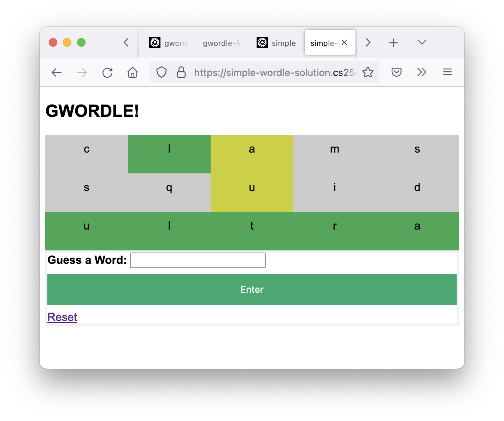

# Backend Instructions  

You must design the backend for gwordle which will take a word guessed by the user and determine the result for each letter:
 - HIT (green): right letter in the right spot
 - MISS (grey): letter is not in the word
 - CLOSE (yellow): letter is in the word, but in the wrong spot

You have been provided a `index.html` file which displays the contents of the `guesses` and `results` variables which you must populate into the session based on user input. The provided file also has a simple form to allow a user to enter a guess.

Your task is to modify the python application so that it takes in a word from the form and determines if each letter in a guess is correct.

**Your job is just to focus on the backend (python code); you should not need to modify the HTML/CSS.**

### STEP 1: Store and display the guesses:
To start, you should modify the code so that a word entered in the form gets stored into the session['guesses'] variable. If you do this correctly, the HTML template should automatically render them as  simple python list.

You also should implement the `/reset` route so that you can clear the session data. You might want to do other checks like limiting the word size and number of guesses that can be submitted.

### STEP 2: Determine the results:
Now try to determine whether the entered guess is correct or not. You have been provided with a `wordle.py` file which contains the basic game logic. You should be able to adapt this code to your program. 

For this step you should be flling in the `session["results"]` variable. For example, if a user enters the guess `clams`, then the result `['MISS', 'HIT', 'CLOSE', 'MISS', 'MISS']` should be generated since `l` is in the correct spot and `a` is in the word, but not in the correct spot (assuming the answer to the puzzle is `ultra`).

For a full example:

```
guesses = ['clams', 'squid', 'ultra']
results = [['MISS', 'HIT', 'CLOSE', 'MISS', 'MISS'], ['MISS', 'MISS', 'CLOSE', 'MISS', 'MISS'],
['HIT', 'HIT', 'HIT', 'HIT', 'HIT']]
```

### STEP 3: Integrate:
Now you can try to merge your backend with a frontend group!


