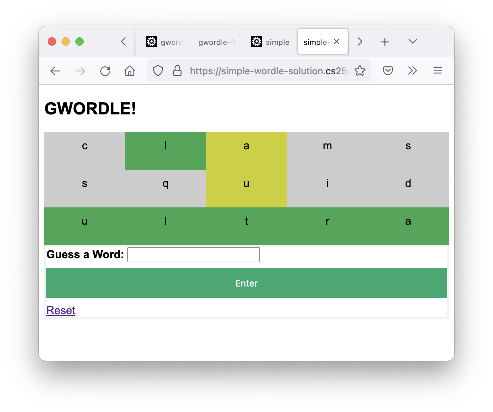

# Frontend Instructions  

You must design the frontend for gwordle which should display the guesses made so far and correctly indicate if each letter was a:
 - HIT (green): right letter in the right spot
 - MISS (grey): letter is not in the word
 - CLOSE (yellow): letter is in the word, but in the wrong spot

You have been provided a `main.py` file which fills data into the `guesses` and `results` variables which are then passed to a template.

Your task is to modify the template so that it correctly displays each of the guesses and whether each letter was correct.

**Your job is just to focus on the frontend (HTML/CSS code); you should not need to modify the python.**

### STEP 1: Display the guesses:
To start, just be sure you can display the list of guesses that are being passed in correctly. You should get:
```
clams
squid
ultra
```

### STEP 2: Display the result info for each letter in each guess:
Now try to output information about both the `guesses` and `results` at the same time. Hint: you may want to use the for loop syntax like 

```

````
Then you can refer to elements in one or more arrays using the normal `array[i]` syntax.

Try to get output like:
```
 clams: c - MISS l - HIT a - CLOSE m - MISS s - MISS
 squid: s - MISS q - MISS u - CLOSE i - MISS d - MISS
 ultra: u - HIT l - HIT t - HIT r - HIT a - HIT

```

### STEP 3: Make it all pretty:
Now you can try to make it pretty. You'll need to learn some new things about CSS!



### STEP 4: Integrate:
Now you can try to merge your frontend with a backend group!  In fact, you can start integration when you finish Step 2.
